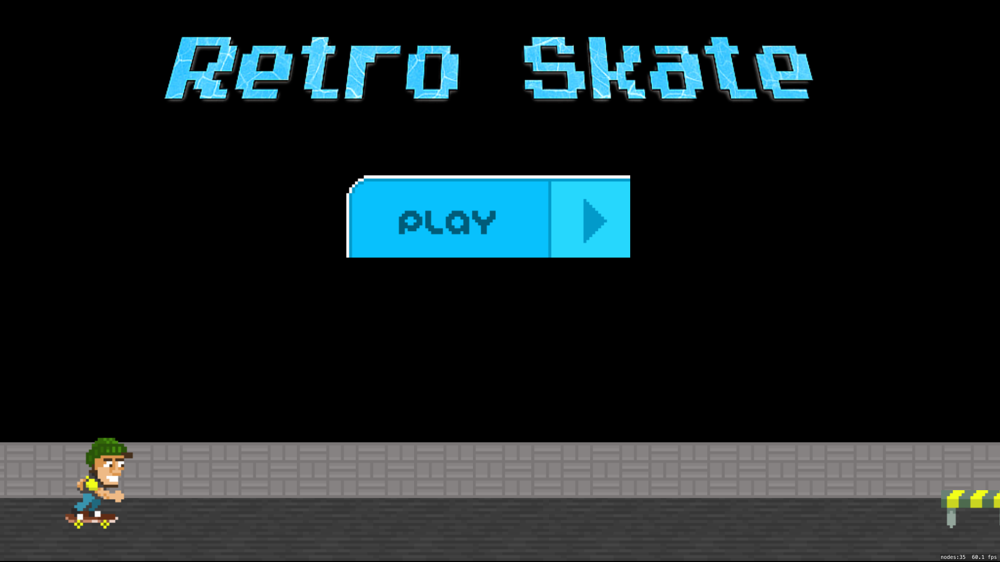
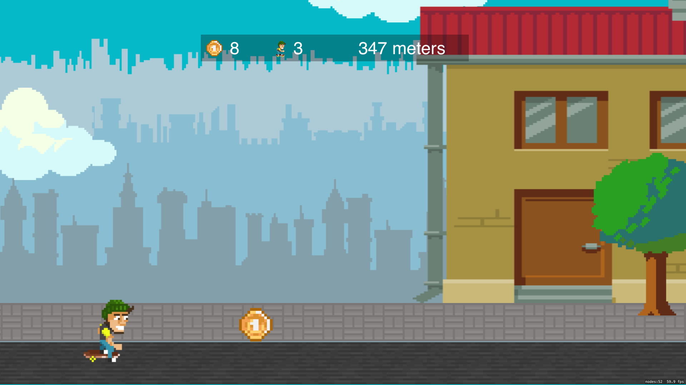
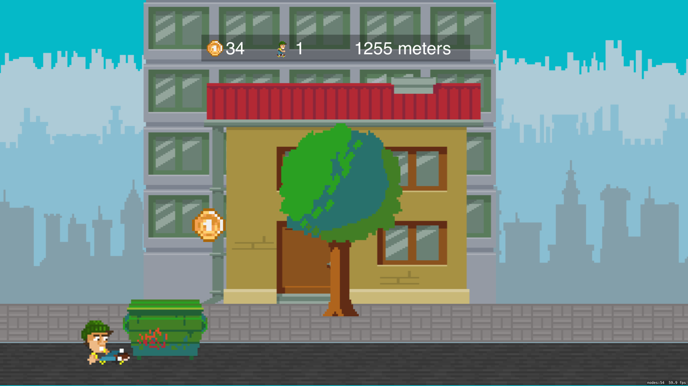
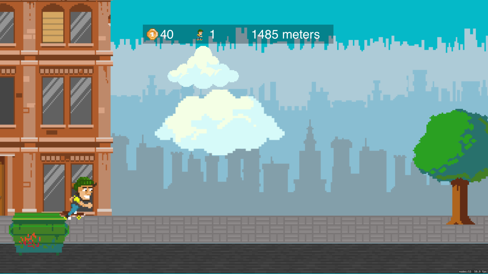
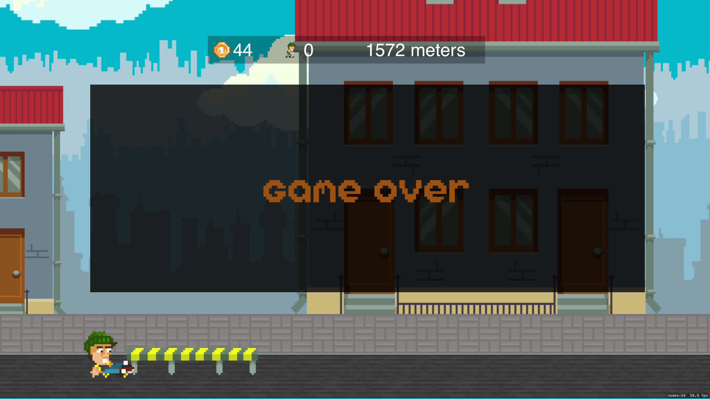

# Retro Skate

A tvOS / SpriteKit skateboarding game.

## TODO
1. ~~Implement any swipe gesture recognizer while in the air to do a hardflip.~~ (when you press up)
2. ~~Generate random coins throughout the level - if the skater touches them, he will collect them~~
3. ~~Show the total amount of coins collected~~
4. ~~Show the total distance travelled~~
5. ~~Show the occasional tree between buildings~~
6. ~~Show random clouds behind the buildings, but in front of the background~~
7. ~~Show the ollie animation whenever the skater jumps~~
8. ~~Implement an Intro Scene with a Play button~~
9. ~~Implement a Game over popup that says game over and alerts the user restart the game~~
10. ~~Implement two other types of ledge obstacles~~
11. ~~Incorporate the fire hydrant obstacle~~
12. ~~Implement a sane Obstacle spawning mechanism~~
